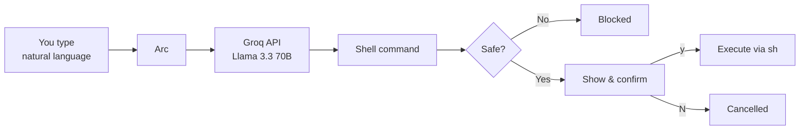

<div align="center">

# ◎ Arc

**Speak Linux. Run commands.**

Turn plain English into shell commands — review them, approve them, execute them.

<br />

[](https://www.rust-lang.org/)
[](https://groq.com/)
[](LICENSE)

<br />

[Quick start](#-quick-start) · [Usage](#-usage) · [How it works](#-how-it-works) · [Safety](#-safety) · [Build from source](#-build-from-source) · [Changelog](CHANGELOG.md) · [License](LICENSE)

</div>

---

## ✦ What is Arc?

**Arc** is a lightweight CLI that bridges natural language and your terminal. Describe what you want in everyday words — *"find the largest files in this folder"*, *"show open ports"*, *"compress all PNGs here"* — and Arc asks Groq's LLM to produce a single, ready-to-run shell command.

Nothing runs until you say so. Every generated command is shown first, then you confirm with `y` before execution.

```
$ arc-ai "list all docker containers sorted by memory usage"
Generated command:
docker stats --no-stream --format "table {{.Name}}\t{{.MemUsage}}" | sort -k2 -h
Execute? [y/N]: y
```

---

## ✦ Features

| | |
|---|---|
| 🗣 **Natural language in** | Plain English → one shell command, no markdown, no fluff |
| 🔍 **Preview before run** | See exactly what will execute; cancel anytime |
| 🛡 **Built-in guardrails** | Blocks known destructive patterns before they reach your shell |
| 🔑 **Simple setup** | One API key, stored locally at `/usr/arc/groq.key` |
| ⚡ **Fast & small** | Single Rust binary — no Python, no Node, no bloat |
| 🧠 **Llama 3.3 70B** | Powered by Groq's `llama-3.3-70b-versatile` model |

---

## ✦ Quick start

### Prerequisites

- **Linux** (or WSL) with `sh` available
- A [Groq API key](https://console.groq.com/)

### Install

```bash
# Clone the repository
git clone https://github.com/Arcnaboo/arc.git
cd arc

# Build and install
cargo install --path .
```

Or build a release binary directly:

```bash
cargo build --release
sudo cp target/release/arc-ai /usr/local/bin/
```

### Configure

Store your Groq API key once:

```bash
arc-ai set gsk_your_groq_api_key_here
```

The key is written to `/usr/arc/groq.key` with `0600` permissions on Unix systems.

---

## ✦ Usage

```bash
# Run a natural language command
arc-ai "show disk usage of current directory"

# Save or update your API key
arc-ai set [Your-groq-key]
```

### Examples

```bash
arc-ai "find files larger than 100MB modified in the last 7 days"
arc-ai "show my public IP address"
arc-ai "count lines of code in all Rust files"
arc-ai "list processes using the most CPU"
```

Each invocation follows the same flow:

1. Your text is sent to Groq with a strict system prompt (one command only, no explanations).
2. Arc prints the generated command.
3. You confirm with `y` or cancel with anything else.
4. On approval, the command runs via `sh -c`.

---

## ✦ How it works



Arc keeps the prompt tight: the model must output **exactly one** shell command — no markdown fences, no comments, no sudo unless you asked for it, no deletions unless you asked for that too.

---

## ✦ Safety

Arc is designed to be helpful, not reckless.

**Confirmation gate** — Nothing executes without your explicit `y`.

**Pattern blocking** — Commands matching known destructive patterns are refused before confirmation, including:

- `rm -rf /` and variants
- `mkfs`, `dd if=`, fork bombs
- Broad `chmod` / `chown` on `/`
- `shutdown`, `reboot`, `poweroff`

**Prompt constraints** — The system prompt instructs the model to prefer safe commands and avoid privilege escalation or file deletion unless explicitly requested.

> **Note:** Arc is a convenience tool, not a security sandbox. Always read generated commands carefully before approving them.

---

## ✦ Configuration

| Path | Purpose |
|---|---|
| `/usr/arc/` | Config directory (created on first `arc-ai set`) |
| `/usr/arc/groq.key` | Your Groq API key |

---

## ✦ Build from source

```bash
git clone https://github.com/Arcnaboo/arc.git
cd arc
cargo build --release
```

The binary lands at `target/release/arc-ai`.

### Dependencies

| Crate | Role |
|---|---|
| [clap](https://crates.io/crates/clap) | CLI parsing |
| [tokio](https://crates.io/crates/tokio) | Async runtime |
| [reqwest](https://crates.io/crates/reqwest) | HTTP client (Groq API) |
| [serde](https://crates.io/crates/serde) | JSON serialization |

---

## ✦ Project structure

```
arc/
├── Cargo.toml       # Package manifest
├── Cargo.lock       # Locked dependencies
├── CHANGELOG.md     # Version history
├── LICENSE          # ARC License (Version 1.1)
├── src/
│   └── main.rs      # CLI, API client, safety checks
└── README.md
```

---

<div align="center">

<br />

**Arc** — because your terminal should understand you.

<br />

Made with Rust · Powered by [Groq](https://groq.com/) · [ARC License 1.1](LICENSE)

</div>
